# SpendLeak — Public Architecture Overview

This document describes SpendLeak at a **system-boundary level**. It intentionally omits proprietary source structure, database schema, internal endpoints, provider credentials/configuration, operational runbooks and implementation details.

```mermaid
flowchart LR
    A[Buyer / Agency] --> B[SpendLeak Web]
    B --> C[Secure Checkout]
    C --> D[Audit Intake]
    D --> E[Destination Evidence Collection]
    E --> F[Evidence Normalisation]
    F --> G[Human Review]
    G --> H[Frozen Audit Report]
    H --> I[Private Delivery]
    I --> J[Eligible Follow-up Check]
    J --> K[Before / After Comparison]
```

## Core boundaries

### Customer boundary
The buyer sees a deliberately small product surface: order, intake, status, report and follow-up. SpendLeak does not require ad-account write access and does not position itself as a campaign-management platform.

### Evidence boundary
Observed destination behaviour is kept distinct from customer-supplied context. This reduces the risk of turning assumptions into evidence.

### Review boundary
Machine-collected evidence is not treated as a customer-ready conclusion by default. Findings pass through a review stage before the report is frozen and delivered.

### Artifact boundary
Delivered reports are immutable artifacts for a specific audit state. A follow-up check creates a comparison against the earlier baseline rather than silently rewriting the original report.

### Provider boundary
External providers are treated as separate systems of record. Ambiguous write outcomes are reconciled before retry authority is considered.

## Technology profile

The production implementation uses a modern TypeScript/React web stack, PostgreSQL-backed state, server-side payment integration, managed deployment infrastructure and external delivery/storage providers.

Exact production configuration, credentials, internal schemas, provider wiring and operational controls are private.

## Design objective

The architecture optimises for a narrow commercial promise:

> Produce a trustworthy, dated record of where paid traffic lands, what changed, and what should be acted on — without requiring ad-account write access.
